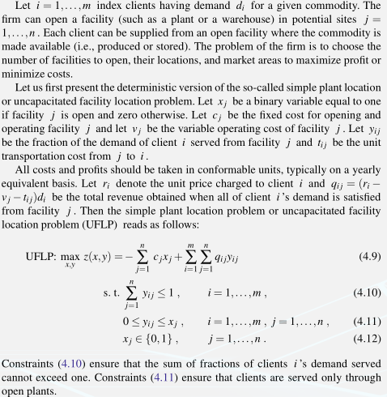

#duction to Stochastic Programming

#+options: tex:t
#+option: bibtext2html

* Models
** Introduction and Examples
*** A Farming Example and the News Vendor Problem
**** The farmer's problem
**** A scenario representation
**** General model formulation
**** Continuous random variables
**** The news vendor problem
*** Financial Planning and Control
*** Capacity Expansion
*** Design for Manufacturing Quality
*** A Routing Example
**** Presentation
**** Wait-and-see solutions
**** Expected value solution
**** Recourse solution
**** Other random variables
**** Chance-constraints
*** Other Applications
** Uncertainty and Modeling Issues
*** Probability Spaces and Random Variables
*** Deterministic Linear Programs
*** Decisions and Stages
- Definitions
  - /Stochastic linear programs/ are linear programs in which some problem data may be considered uncertain.
  - /Recourse programs/ are those in which some decisions or recourse actions may be taken after uncertainty is disclosed.

The set of decisions is then divided into two groups:

- A number of decisions have to be taken before the experiment. All these decisions are called first-stage decisions and
  the period when these decisions are taken is called the first stage.
- A number of decisions can be taken after the experiment. They are called second-stage decisions. The corresponding
  period is called the second stage.

The first-stage decisions are represented by the vector $x$ and the second-stage decision variables are represented by
the vector $y$, $y(\omega)$, or even $y(\omega , x)$ if one wishes to be explicit that the second-stage decisions differ
as a function of the outcome of the random experiment of the first-stage. $\omega \in \Omega$ refers to a random event.

*** Two-Stage Program with Fixed Recourse

#+begin_latex latex
\begin{equation}
\begin{array}{c}
  \text{min } z = c^Tx + E_{\xi} [\text{min } q(\omega) y(\omega)] \\
  \text{s.t } Ax = b                                   \\
  T(\omega)x + Wy(\omega) = h(\omega)                                 \\
  x \ge 0, y(\omega) \ge 0                                      \\
\end{array}
\end{equation}
#+end_latex

Consider [[fig:location-problem]]. Refer to the location problem on page 61 in \cite{Birge-2011} for the /location problem/.
This example is used is subsequent sections to demonstrate different examples of recourse formulations.

#+name: fig:location-problem

**** Fixed distribution pattern, fixed demand, $r_i$, $v_j$, $t_{ij}$ stochastic
- Uncertainties: production and distribution costs and prices charged to the clients

**** Fixed distribution pattern, uncertain demand
**** Uncertain demand, variable distribution pattern
**** Stages versus periods; Two-stage versus multistage
*** Random Variables and Risk Aversion
*** Implicit Representation of the Second Stage
**** A closed form expression is available for Q
**** For a given x, Q is computable
*** Probabilistic Programming
**** Deterministic linear equivalent: a direct case
**** Deterministic linear equivalent: an indirect case
**** Deterministic nonlinear equivalent: the case of random co
*** Modeling Exercise
**** Presentation
**** Discussion of solutions
*** Alternative Characterizations and Robust Formulations
**** Statistical decision theory and decision analysis
**** Dynamic programming and Markov decision processes
**** Machine learning and online optimization
**** Optimal stochastic control
**** Summary
*** Short Reviews
**** Linear programming
**** Duality for linear programs
**** Nonlinear programming and convex analysis
* Part II: Basic Properties
** Basic Properties and Theory
*** Two-Stage Stochastic Linear Programs with Fixed Recourse
**** Formulation
**** Discrete random variables
**** General cases
**** Special cases: relatively complete, complete,and simple r
**** Optimality conditions and duality
**** Stability and nonanticipativity
*** Probabilistic or Chance Constraints
**** General case
**** Probabilistic constraints with discrete random variables
*** Stochastic Integer Programs
**** Recourse problems
**** Simple integer recourse
**** Probabilistic constraints
*** Multistage Stochastic Programs with Recourse
*** Stochastic Nonlinear Programs with Recourse
** The Value of Information and the Stochastic Solut
*** The Expected Value of Perfect Information
*** The Value of the Stochastic Solution
*** Basic Inequalities
*** The Relationship between EVPI and VSS
**** EVPI = 0 and VSS =0
****  VSS = 0 and EVPI=0
*** Examples
*** Bounds on EVPI and VSS
* Part III: Solution Methods
** Two-Stage Recourse Problems
*** The L-Shaped Method
**** Optimality cuts
**** Feasibility cuts
**** Proof of convergence
**** The multicut version
*** Regularized Decomposition
*** The Piecewise Quadratic Form of the L-shaped Methods
**** Full decomposability
**** Bunching
*** Basis Factorization and Interior Point Methods
*** Inner Linearization Methods and Special Structures
*** Simple and Network Recourse Problems
*** Methods Based on the Stochastic Program Lagrangian
*** Additional Methods and Complexity Results
** Multistage Stochastic Programs
*** Nested Decomposition Procedures
*** Quadratic Nested Decomposition
*** Block Separability and Special Structure
*** Lagrangian-Based Methods for Multiple Stages
** Stochastic Integer Programs
*** Stochastic Integer Programs and LP-Relaxation
*** First-stage Binary Variables
**** Improved optimality cuts
**** Example with continuous random variables
*** Second-stage Integer Variables
**** Looking in the space of tenders
**** Discontinuity points
**** Algorithm
*** Reformulation
**** Difficulties of reformulation in stochastic integer progr
**** Disjunctive cuts
**** First-stage dependence
**** An algorithm
*** Simple Integer Recourse
****  restricted to be integer
**** The case where S=1,  not integral
*** Cuts Based on Branching in the Second Stage
**** Feasibility cuts
**** Optimality cuts
*** Extensive Forms and Decomposition
*** Short Reviews
**** Branch-and-bound
**** A simple example of valid inequalities
**** Disjunctive cuts
* Part IV: Approximation and Sampling Methods
** Evaluating and Approximating Expectations
*** Direct Solutions with Multiple Integration
*** Discrete Bounding Approximations
*** Using Bounds in Algorithms
*** Bounds in Chance-Constrained Problems
*** Generalized Bounds
**** Extensions of basic bounds
**** Bounds based on separable functions
**** General-moment bounds
*** General Convergence Properties
** Monte Carlo Methods
*** Sample Average Approximation and Importance Samplingin t
*** Stochastic Decomposition
*** Stochastic Quasi-Gradient Methods
*** Sampling Methods for Probabilistic Constraints and Quant
*** General Results for Sample Average Approximation and Seq
** Multistage Approximations
*** Extensions of the Jensen and Edmundson-Madansky Inequal
*** Bounds Based on Aggregation
*** Scenario Generation and Distribution Fitting
*** Multistage Sampling and Decomposition Methods
*** Approximate Dynamic Programming and Special Cases
**** Network revenue management
**** Vehicle allocation problems
**** Piecewise-linear separable bounds
**** Nonlinear bounds and a production planning example
**** Extensions
* Appendix A Sample Distribution Functions
** 1 Discrete Random Variables
** 2 Continuous Random Variables
* References
* Author Index
* Subject Index

\bibliographystyle{plain}
\bibliography{main}
